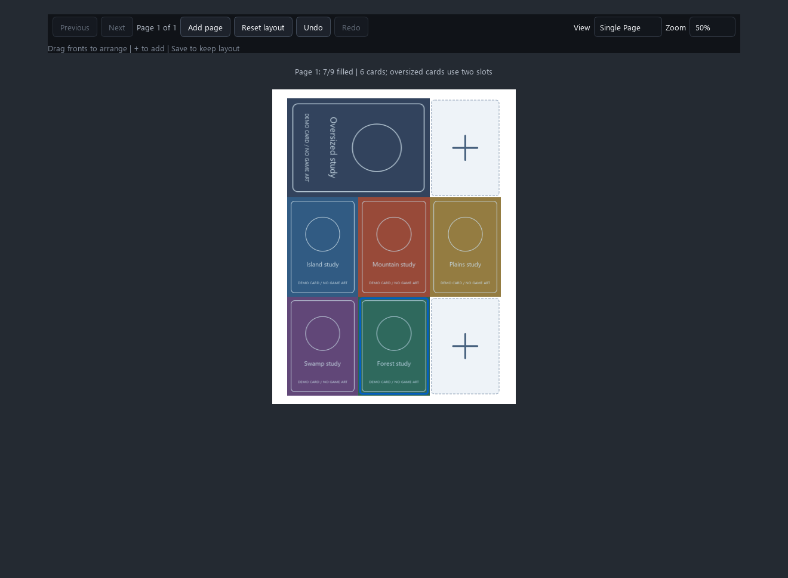
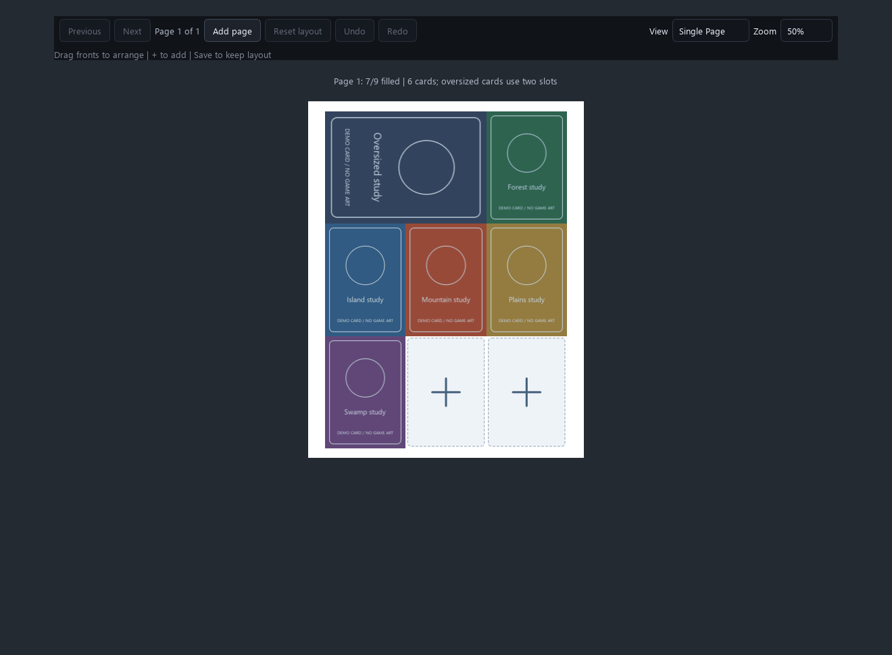
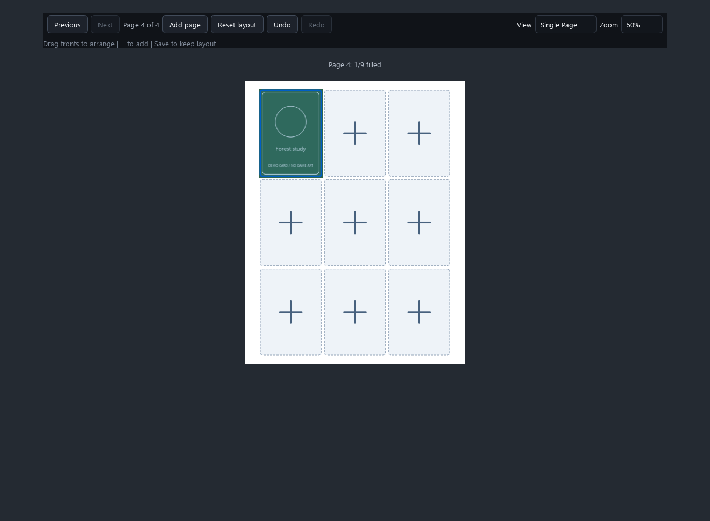
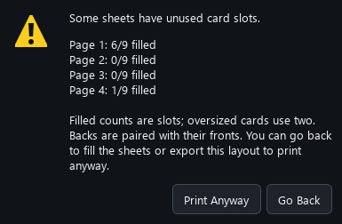
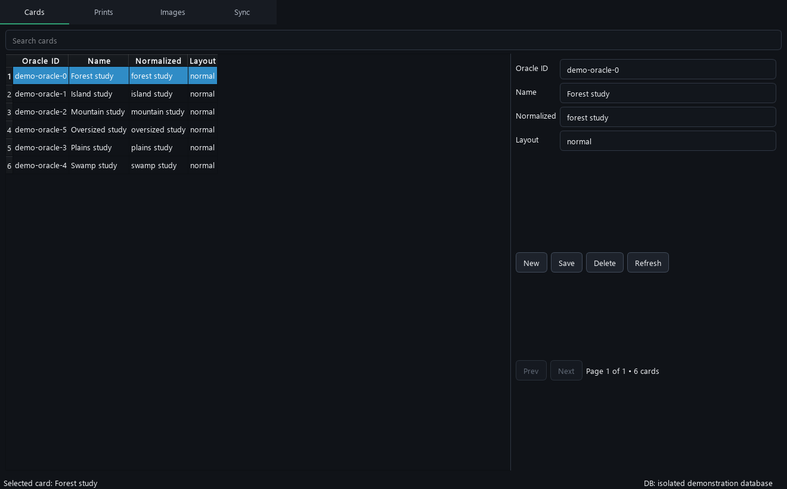
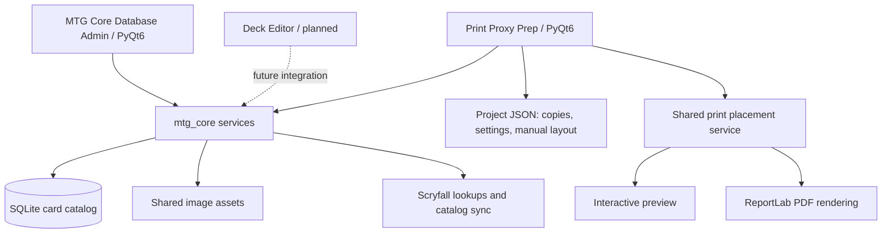

# Manaforge

[](https://github.com/RyMeep128/Manaforge/actions/workflows/tests.yml)

Manaforge is a Python / PyQt6 desktop suite for preparing Magic: The Gathering proxies, managing shared card data, and building toward a dedicated deck editor.

Manaforge is organized around **three apps**, with a shared card-data layer.

| App | Purpose | Current status |
| --- | --- | --- |
| **Print Proxy Prep** | Import cards, prepare images, arrange print sheets, and export PDFs with paired backs and oversized cards. | Runnable; Windows launchers and app-bundle build included. |
| **MTG Core Database Admin** | Browse and manage cards, printings, images, and catalog synchronization. | Runnable Qt app backed by the shared `mtg_core` library. |
| **MTG Deck Editor** | Planned visual deckbuilding, grouping, statistics, and handoff to print preparation. | Specification stage; no runnable editor yet. [Read the epic](Mtg_Projects/mtg_editor/docs/deck-editor-epic.md). |

## See the apps

### Print Proxy Prep



Drag individual printed copies into exact slots, swap cards when they fit, or click **+** to add a card. Oversized cards occupy two horizontal slots; backs follow the fronts. Save the project to preserve placement, and export the same layout to PDF.



Each sheet reports occupancy, such as **Page 4: 1/9 filled**. Under-filled sheets trigger a warning before export with **Go Back** and **Print Anyway**. Counts represent occupied slots, so oversized cards count as two. Empty trailing editing sheets are omitted; intentional gaps between populated sheets remain.





### MTG Core Database Admin



These are captures of the actual Qt widgets using isolated demonstration data and original placeholder cards. The GIF demonstrates rendered move/undo/redo states. Regenerate them with `tools/capture_docs.py`; no user projects or live network lookups are used.

## Install and launch on Windows

Install Python with the Windows `py` launcher. CI targets Python **3.12 and 3.13**. Then clone or download this repository and run:

```powershell
& '.\Mtg_Projects\mtg_proxy\Setup Print Proxy Prep.cmd'
& '.\Mtg_Projects\mtg_proxy\Launch Print Proxy Prep.cmd'
```

Setup creates `Mtg_Projects/mtg_proxy/venv` and installs the shared runtime dependencies. To launch the database app using that same environment:

```powershell
& '.\Mtg_Projects\mtg_core\Launch MTG Core Admin.cmd'
```

The Deck Editor has no launch command yet. Windows is the packaged target; the code includes data-path handling for other platforms, but this repository does not provide macOS/Linux bundles or CI coverage for them.

### First print project

1. Create/open a project and add individual cards, import a decklist, or choose existing images.
2. Prepare images and configure paper, bleed, and optional backs/oversized cards.
3. Open **Preview**, arrange copies, and check each sheet's filled-slot count.
4. Use **Undo / Redo** or `Ctrl+Z` / `Ctrl+Y` (`Ctrl+Shift+Z` also works) while focused in Preview. History covers moves, resets, added editing pages, and successful slot additions, including their quantities. It is session-only and clears after unrelated project/settings changes.
5. **Save Project**, then export the PDF. If sheets are under-filled, choose **Go Back** or **Print Anyway**.
6. Print the PDF from your viewer with the intended scaling and duplex settings. Exporting does not send a physical printer job.

Backside offsets and output settings are saved per project. **Print Settings → Printer profiles…** saves reusable paper, backside, alignment, and duplex preferences and lets you apply them to other projects. See [printer setup](docs/printing-roadmap.md) for details and the planned calibration PDF workflow.

Named projects autosave after two seconds without edits. The header and window title show `*` while changes are unsaved; successful autosaving or **Save Project** clears it. New drafts need their first Save to choose a name. Closing or switching away saves pending work, and a failed save keeps the project open and marked unsaved.

For large projects, unchanged card widgets and decoded previews are reused and preview-cache disk access is batched. **More → Application settings… → Preview Image Cache** controls the decoded-image RAM budget (256 MB default; up to 2048 MB), independently of export quality.

For supported import formats, image preparation, and detailed controls, see the [Print Proxy Prep guide](Mtg_Projects/mtg_proxy/README.md).

## Build the Windows app bundle

From the repository root:

```powershell
& '.\Mtg_Projects\Build EXE.cmd'
```

The script installs PyInstaller, rebuilds the product `build` and `dist` directories, and produces:

- `Mtg_Projects/dist/Print Proxy Prep/Print Proxy Prep.exe`
- `Mtg_Projects/dist/PrintProxyPrep-<version>-win.zip`

This bundle packages **Print Proxy Prep** and its shared dependencies. Core Admin currently runs from source; Deck Editor is not yet implemented.

## Shared architecture



| Directory | Responsibility |
| --- | --- |
| `Mtg_Projects/mtg_proxy/` | Print UI, project library, image preparation, import orchestration, preview, and PDF export. |
| `Mtg_Projects/mtg_core/mtg_core/` | Card/printing models, SQLite access, image storage, search, synchronization, and shared services. |
| `Mtg_Projects/mtg_core/mtg_core_gui/` | Core Database Admin interface. |
| `Mtg_Projects/mtg_editor/` | Deck Editor specification and future app boundary. |
| `Mtg_Projects/integration_tests/` | Proxy/Core contract tests. |

On Windows, runtime data defaults to `%LOCALAPPDATA%\PrintProxyPrep`; the shared catalog and assets live beneath its `mtg_core` directory. Set `PRINT_PROXY_PREP_DATA_DIR` to isolate development/test data. Project JSON references shared assets rather than embedding full-resolution images. Keep runtime databases, caches, virtual environments, and generated bundles out of commits.

## Development and tests

Manaforge is in alpha/beta development. Commits increment the patch version (for example, `0.2.1-alpha.1` → `0.2.2-alpha.1`); merges into `main` increment the minor version and reset patch (`0.2.2-alpha.1` → `0.3.0-alpha.1`). `APP_VERSION` in `Mtg_Projects/mtg_proxy/constants.py` is the source for the app and build archive name. Alpha/beta builds stay marked as prereleases; tagging or publishing a release is a separate step. See [versioning instructions](AGENTS.md).

From the repository root, after setup:

```powershell
& '.\Mtg_Projects\mtg_proxy\venv\Scripts\python.exe' -m pip install -r requirements-dev.txt
$env:QT_QPA_PLATFORM = 'offscreen'
Push-Location Mtg_Projects
& '.\mtg_proxy\venv\Scripts\python.exe' -m pytest -q
Pop-Location
```

[CI](.github/workflows/tests.yml) runs the Proxy, Core, and integration tests on pushes and pull requests, with a manual workflow trigger as well. Qt tests run offscreen and CI uses a temporary application-data directory. Workflow setup follows the official [checkout](https://github.com/actions/checkout) and [setup-python](https://github.com/actions/setup-python) actions.

To refresh the screenshots and GIF:

```powershell
& '.\Mtg_Projects\mtg_proxy\venv\Scripts\python.exe' tools/capture_docs.py
```

Repository description and discovery topics are maintained in [repository-metadata.json](docs/repository-metadata.json). GitHub's About fields are separate from tracked files.
To apply those values to `origin`, run `tools/update_repository_metadata.py` with the same Python environment; it uses your configured GitHub credential and preserves existing topics.
